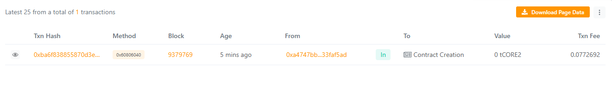

# TokenAuditTrail: Immutable Record of Token Transactions for Compliance

## Project Description
TokenAuditTrail is a Solidity smart contract designed to provide a secure, immutable ledger of token transactions specifically tailored for compliance auditing purposes. The contract records every token transfer with detailed information including sender, receiver, amount, timestamp, and the originating transaction hash. This transparency and immutability help organizations comply with regulatory requirements by providing a verifiable transaction audit trail on-chain.

## Project Vision
Our vision is to empower blockchain projects, financial institutions, and regulatory bodies with an accessible and tamper-proof token transaction log that enhances trust, accountability, and compliance in decentralized ecosystems. TokenAuditTrail aims to be the go-to compliance layer that integrates seamlessly with any token system, making audits and reporting streamlined and reliable.

## Key Features
- **Immutable Transfer Logging:** Every token transfer is logged immutably on-chain, ensuring a permanent record.
- **Detailed Records:** Logs include sender, recipient, amount, timestamp, and original transaction hash for robust auditing.
- **Admin-Controlled Logging:** Only authorized admins can log transfers, ensuring data integrity.
- **On-chain Access:** Transfer records can be accessed via public view functions for transparency.
- **Event Emission:** Emits events for easy off-chain indexing and monitoring by compliance tools.
- **Simple Integration:** Designed to work alongside existing token contracts by logging their transfers.

## Future Scope
- Multi-admin role support with customizable permissions.
- Integration with popular token standards (ERC20, ERC721) for automated transfer detection.
- Advanced querying and filtering capabilities for audit reports.
- Off-chain compliance dashboards and alerting systems powered by the contract events.
- Support for cross-chain transfer logging.
- Incorporation of cryptographic proofs for enhanced data verification.

## Contract Details
0xCEa78E18E2C224E4d4B17CD34717468505259128

